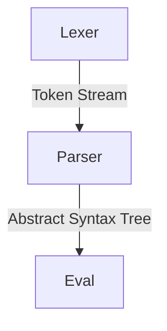

# B-shell

a custom POSIX-compliant shell inspired by bash.

Requirements:
- Go >= 1.25.1


## Architecture 


```mermaid
graph TD
    A[Lexer] -->|Token Stream| B[Parser]
    B -->|Abstract Syntax Tree| C[Eval]
```

Run:
```zsh
go run main.go
```

